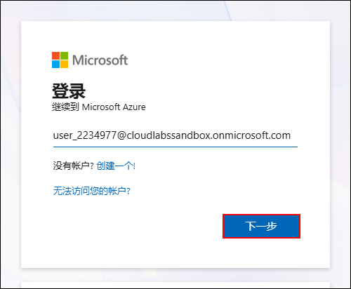
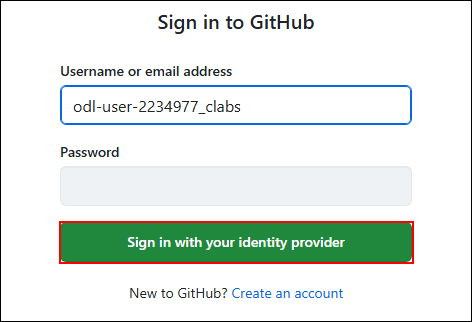
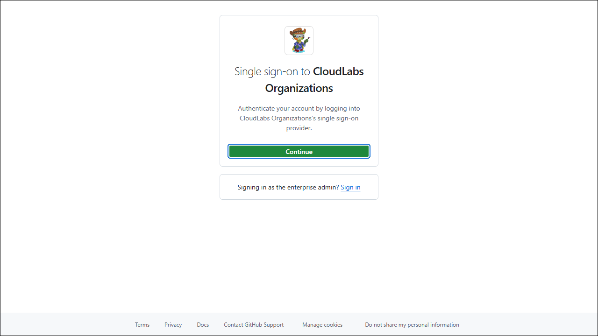

# 开始使用沙盒环境

## 登录 Azure 门户

1. 使用新的浏览器标签页导航到 [Azure 门户](https://portal.azure.com)。
   
1. 在 **[登录 Microsoft Azure]** 标签页中，您将看到登录界面。输入以下电子邮件/用户名，然后单击 **[下一步]**。

   * 电子邮件/用户名: <inject key="AzureAdUserEmail"></inject>
   
     

     > **注意:** 如果出现 **[下载 Microsoft Edge 移动应用]** 弹出窗口，请单击 **[不显示]** 下拉菜单并选择 **[不再显示此建议]**。
     
1. 输入以下密码，然后单击 **[登录]**。

   * 密码: <inject key="AzureAdUserPassword"></inject>
   
     
  
1. 如果出现 **[保持登录状态?]** 弹出窗口，请单击 **[否]**。

1. 如果出现 **[您有免费的 Azure Advisor 建议!]** 弹出窗口，请关闭该窗口以继续实验。

1. 如果出现 **[欢迎使用 Microsoft Azure]** 弹出窗口，请单击 **[以后再说]** 跳过引导。

## 登录 GitHub

1. 请在您的浏览器中打开 InPrivate/隐身窗口，按照以下步骤激活您的 GitHub 账户。

1. 导航到以下 URL 以接受邀请。

   - **InviteRedirectURL:** `https://myapplications.microsoft.com/?tenantid=f871d17e-efcd-44c7-ba5a-0162efa2fded`

1. 您将看到 **[登录]** 标签页。在此输入您的凭据：
 
   - **电子邮件/用户名:** **<inject key="AzureAdUserEmail"></inject>**
 
       

1. 接下来，输入您的密码以登录：
 
   - **密码:** **<inject key="AzureAdUserPassword"></inject>**
 
      

1. 在下一个窗口中，单击 **[接受]** 以接受邀请。

1. 如果出现 **[保持登录状态?]** 弹出窗口，请单击 **[否]**。

1. 完成后，关闭此浏览器标签页，使用以下 URL 在新的浏览器标签页中导航到 GitHub 登录页面：

   ```
   https://github.com/login
   ```

1. 在 **[登录 GitHub]** 标签页中，您将看到登录界面。输入提供的 GitHub 用户名，然后单击 **[使用身份提供程序登录]** 以继续 **(2)**。

   - GitHub 用户: 

    ```
    odl-user-<inject key="Deployment ID" enableCopy="false"/>_clabs
    ```

    

1. 在 **[单点登录到 CloudLabs Organizations]** 页面上单击 **[继续]**。

   

1. 如果要求登录，请使用环境提供的电子邮件和密码登录：

   - **电子邮件/用户名:** **<inject key="AzureAdUserEmail"></inject>**

   - **密码:** **<inject key="AzureAdUserPassword"></inject>**

1. 您已成功登录 GitHub。


一切就绪！现在可以开始了！
