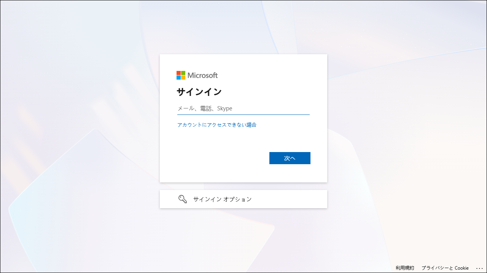

# Getting Started with the Sandbox

## Login to Azure Portal

1. Navigate to [Azure Portal](https://portal.azure.com) using a new browser tab.
   
1. On **Sign into Microsoft Azure** tab you will see the login screen, in that enter the following email/username and then click on **Next**. 

   * Email/Username: <inject key="AzureAdUserEmail"></inject>
   
     

     > **Note:** If you get a **Download Microsoft Edge mobile app** popup, then click on **Do not show** dropdown and select **Don't show this recommendation again**. 
     
1. Now enter the following password and click on **Sign in**.

   * Password: <inject key="AzureAdUserPassword"></inject>
   
     
  
1. If you see the pop-up **Stay Signed in?**, click No

1. If you see the pop-up **You have free Azure Advisor recommendations!**, close the window to continue the lab.

1. If a **Welcome to Microsoft Azure** popup window appears, click **Maybe Later** to skip the tour.

## Login to GitHub

1. Please open a browser on your laptop, preferably an InPrivate/Incognito window and follow the steps below to activate your GitHub account. 

1. Navigate to the given URL to accept the invite.

   - **InviteRedirectURL:** `https://myapplications.microsoft.com/?tenantid=f871d17e-efcd-44c7-ba5a-0162efa2fded`

1. You'll see the **Sign in** tab. Here, enter your credentials:
 
   - **Email/Username:** **<inject key="AzureAdUserEmail"></inject>**
 
       

1. Next, provide your password to login:
 
   - **Password:** **<inject key="AzureAdUserPassword"></inject>**
 
      

1. In the next pane, click on **Accept** to accept the invitation.

    

1. If you see the pop-up **Stay Signed in?**, click No

1. Once done you can close this browser tab, navigate to GitHub login page in a new browser tab using the provided URL below:

   ```
   https://github.com/login
   ```

1. On the **Sign in to GitHub** tab, you will see the login screen. enter your GitHub username as the username provided, then click on **Sign in with your identity provider** to continue **(2)**.

   - GitHub User: 

    ```
    odl-user-<inject key="Deployment ID" enableCopy="false"/>_clabs
    ```

    

1. Click on **Continue** on the **Single sign-on to CloudLabs Organizations** page to proceed.

   

1. If it ask for login, please login using your useremail and password, provided with the environmnet: 

   - **Email/Username:** **<inject key="AzureAdUserEmail"></inject>**

   - **Password:** **<inject key="AzureAdUserPassword"></inject>**

1. You are successfully logged in to GitHub.


All the best! now, you are all set to start!.


