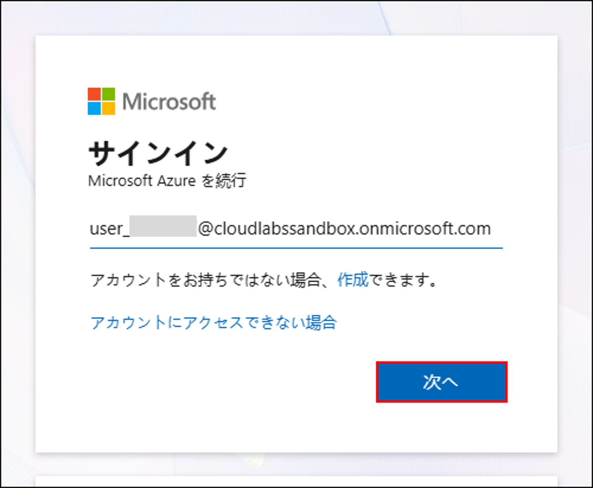
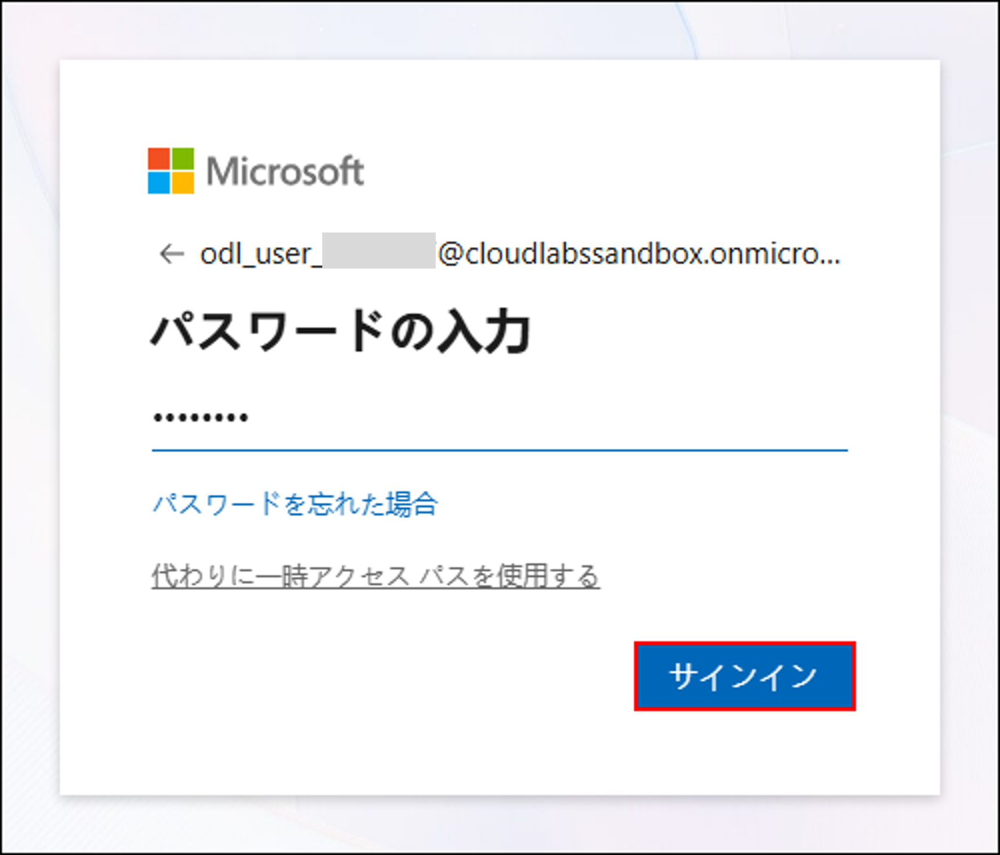
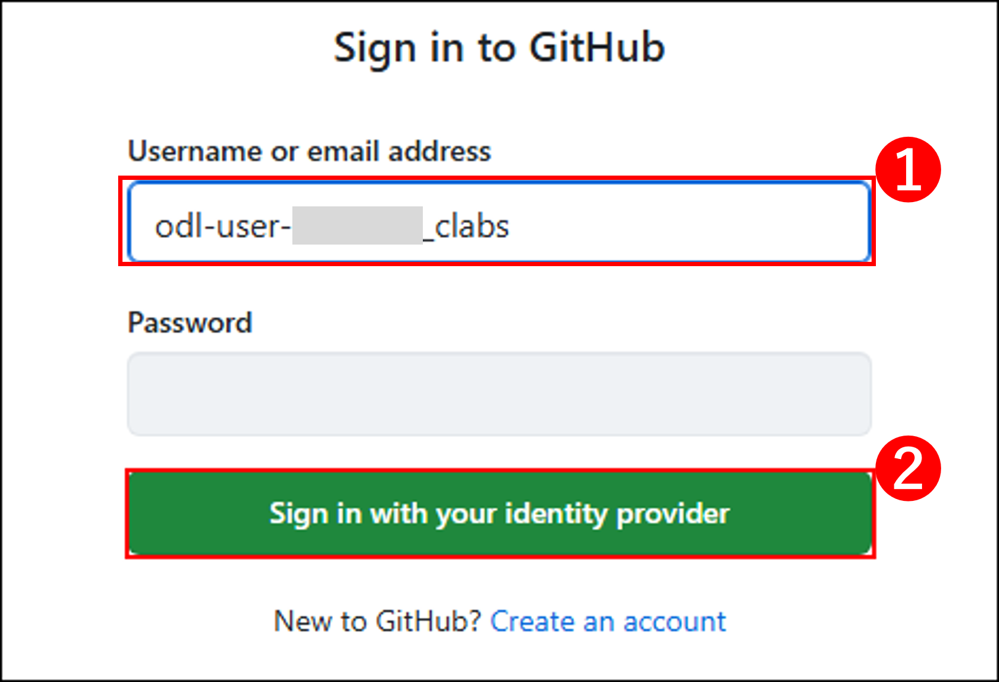
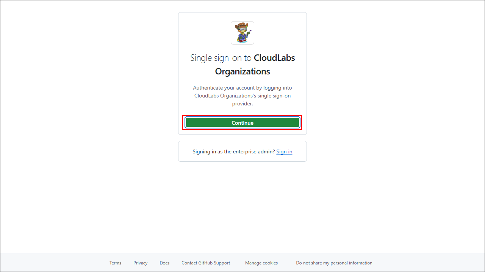

# サンドボックスの使用を開始する

## Azure ポータルへのログイン

1. 新しいブラウザー タブを使用して [Azure ポータル](https://portal.azure.com) に移動します。
   
1. **[Microsoft Azure にサインイン]** タブにログイン画面が表示されます。以下のメール アドレス/ユーザー名を入力し、**[次へ]** をクリックします。

   * メール アドレス/ユーザー名: <inject key="AzureAdUserEmail"></inject>
   
     

     > **注:** **[Microsoft Edge モバイル アプリをダウンロード]** というポップアップが表示された場合は、**[表示しない]** ドロップダウンをクリックし、**[このおすすめを今後表示しない]** を選択してください。
     
1. 以下のパスワードを入力し、**[サインイン]** をクリックします。

   * パスワード: <inject key="AzureAdUserPassword"></inject>
   
     
  
1. **[サインインの状態を維持しますか?]** というポップアップが表示された場合は、**[いいえ]** をクリックします。

1. **[Azure Advisor の無料の推奨事項があります!]** というポップアップが表示された場合は、ウィンドウを閉じてラボを続行します。

1. **[Microsoft Azure へようこそ]** というポップアップ ウィンドウが表示された場合は、**[後で行う]** をクリックしてツアーをスキップします。

## GitHub へのログイン

1. ブラウザーを開き (InPrivate/シークレット ウィンドウを推奨)、以下の手順に従って GitHub アカウントを有効化してください。

1. 以下の URL にアクセスして招待を承認します。

   - **招待リダイレクト URL:** `https://myapplications.microsoft.com/?tenantid=f871d17e-efcd-44c7-ba5a-0162efa2fded`

1. **[サインイン]** タブが表示されます。以下の資格情報を入力してください。
 
   - **メール アドレス/ユーザー名:** **<inject key="AzureAdUserEmail"></inject>**
 
     

1. 次に、パスワードを入力してログインします。
 
   - **パスワード:** **<inject key="AzureAdUserPassword"></inject>**
 
     

1. 次のウィンドウで **[承認]** をクリックして招待を承認します。

1. **[サインインの状態を維持しますか?]** というポップアップが表示された場合は、**[いいえ]** をクリックします。

1. 完了したら、このブラウザー タブを閉じ、以下の URL を使用して新しいブラウザー タブで GitHub ログイン ページに移動します。

   ```
   https://github.com/login
   ```

1. **[GitHub にサインイン]** タブにログイン画面が表示されます。提供された GitHub ユーザー名を入力し、**[ID プロバイダーでサインイン]** をクリックして続行します **(2)**。

   - GitHub ユーザー: 

    ```
    odl-user-<inject key="Deployment ID" enableCopy="false"/>_clabs
    ```

    

1. **[CloudLabs Organizations へのシングル サインオン]** ページで **[続行]** をクリックして次に進みます。

   

1. ログインを求められた場合は、環境で提供されたメール アドレスとパスワードを使用してログインしてください。

   - **メール アドレス/ユーザー名:** **<inject key="AzureAdUserEmail"></inject>**

   - **パスワード:** **<inject key="AzureAdUserPassword"></inject>**

1. GitHub へのログインが完了しました。

お疲れさまです! 準備が整いました。さっそく始めましょう!
