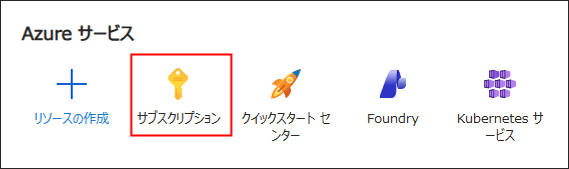
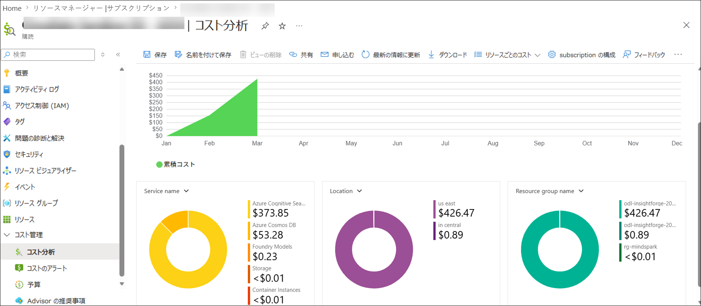

# ASIA - AI CoE 2026

このサンドボックス環境では、Copilot Studio、Copilot for M365、Dynamics 365 スイートを含む幅広い機能とサービスをご利用いただけます。サンドボックス環境の詳細な概要を以下にご説明します。

## サンドボックス環境について

   | リソース | 値 | 備考 |
   | --- | --- | --- |
   | 有効なサービス | `Microsoft Fabric`   `その他の Azure サービス` | サブスクリプションの Owner ロール権限でご利用可能なリソースをご自由にお探しいただけます |
   | Azure Entra ID ユーザー | 事前作成済みの Entra ID ユーザー アカウント | Entra ID ユーザー アカウントが 1 つ提供されます。 |
   | Azure サブスクリプション権限 | Azure サブスクリプションの **所有者** 権限 | Azure サブスクリプションに対して所有者アクセスが付与されます。 |
   | Azure クレジット | **$250 USD** | グループあたりの Azure 使用額の上限は 250 USD に設定されています。 |
   | 割り当て済みライセンス | `Microsoft Copilot Business`   `Office 365 apps`   `Power Apps Premium`   `GitHub Copilot`   `Microsoft Copilot Studio User License`   `Dynamics 365 Finance`   `Dynamics 365 Supply Chain Management`   `Dynamics 365 Project Operations`   `Dynamics 365 Sales Enterprise Edition`   `Dynamics 365 Human Resources`   `Dynamics 365 Field Service`   `Dynamics 365 Business Central Essentials`   `Dynamics 365 Customer Service Enterprise` | 以下のライセンスが割り当てられ、ご利用いただけます。 |
   | クレジット アラート | Azure クレジット消費量が合計の 25%、50%、75%、85%、90%、95%、100% に達した際にクレジット アラートが送信されます。 | アラート関連のメールが届いていないか、登録済みのメール受信トレイをご確認ください。アラートにより、Azure の使用状況を把握し、残りのクレジットを最適に活用するための準備が整います。 |
   | サンドボックス期間 | 30 日/720 時間、または Azure 使用クレジットが消尽した時点のいずれか早い方 | サンドボックス環境は、30 日/720 時間の経過後、または Azure クレジットが消尽した時点で、いずれか早い方のタイミングで自動的に削除されます。 |

## 注意事項:
* Azure クレジットの消費には、サンドボックス環境でのハッカソン ユース ケースに使用するために展開するすべてのリソースが含まれます。
* Azure サブスクリプションに対してオーナー アクセスが付与されます。必要なサービスの機能を自由にお試しいただけますが、学習目的での使用を推奨します。
* 各サンドボックス環境には USD 250 の固定予算上限があります。サンドボックスの範囲外にリソースを展開しないようにしてください。割り当てられた Azure クレジットが消費され、クレジット上限に達した際に環境が自動的に削除される場合があります。

## Microsoft Fabric のコスト最適化

Microsoft Fabric キャパシティを展開する際は、F2 キャパシティを使用することをお勧めします。ほとんどのワークロードに十分対応でき、割り当てられた Azure クレジットを効率よく活用しながらコストを最適化できます。

## Azure OpenAI のコスト最適化:
Azure OpenAI サービスには、Standard と PTU ベースの 2 種類のデプロイ SKU があります。PTU ベース モデルは強力ですが、**1 時間あたり $2** と非常にコストが高く、このモデルを展開すると 1 日あたり **$48** のコストが発生するため、コスト効率の良い選択肢とは言えません。また、PTU ベース モデルを展開すると 2 から 3 日でクレジットが消尽し、環境が自動的に削除される可能性があります。そのため、より手頃で持続可能な展開戦略として **Standard (オンデマンド)** 料金モデルを選択されることをお勧めします。

## コストの監視:
Azure クレジットの消費状況を監視および分析するには、以下の手順に従って Azure サブスクリプション ページに移動してください。
+ Azure ポータルのホーム ページで、検索バーを使用して **[サブスクリプション] (1)** を検索し、候補から選択します。
  
  
  
+ [コスト管理] ウィンドウから [コスト分析] タブを選択します。さまざまなサービスやリソースに関連するコストを詳細に確認できる Azure 支出の包括的な内訳にアクセスできます。

  

+ 正確な消費コストを確認するには、**[コスト分析]** から **[カレンダー]** を選択し、**[カスタム日付範囲]** を選択します。

+ カスタム日付を選択します。
    + **開始日:** 引き換えコードを使用してサンドボックス環境を起動した日付。
    + **終了日:** 現在または将来の日付。将来の日付を選択すると、現在展開しているリソースに基づいた予測コストも確認できます。
    + **実際のコスト (USD)** と **予測: グラフ表示オン** のコストが表示されます。

## ベスト プラクティス:
+ **リソースの使用:** 使用していない仮想マシン、Web Apps、Azure Kubernetes Service、Azure Container Instance などのリソースは停止して、Azure の使用コストを最小限に抑えてください。
+ **Azure コスト分析:** 割り当てられた Azure サブスクリプションのコスト分析レポートを定期的に確認し、環境を長期間にわたって持続可能な状態に保つことをお勧めします。
+ **アラート通知:** アラート関連のメールが届いていないか、登録済みのメール受信トレイをご確認ください。アラートにより、Azure の使用状況を把握し、残りのクレジットを最適に活用するための準備が整います。

## CloudLabs サポート連絡先:
サンドボックス環境のご利用中に問題が発生した場合、権限に関するご質問、または Azure 消費に関するお問い合わせは、サポート チームまでご連絡ください。

* サンドボックス ユーザー メール サポート: cloudlabs-support@spektrasystems.com
* サンドボックス ユーザー ライブ チャット サポート: https://cloudlabs.ai/ms-support

サポートへのご連絡の際は、以下の情報をご提供ください。
+ 「私は **ASIA - AI CoE 2026** の参加者です。登録済みメール アドレスは `email@contoso.com` です。」に続けてご質問/問題をお伝えください。
