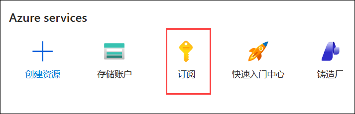
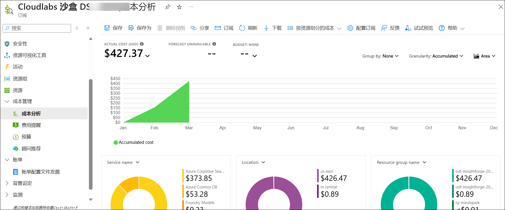

# ASIA - AI CoE 2026

使用此环境，您可以探索包括 Copilot Studio、Copilot for M365 和 Dynamics 365 套件在内的各种功能和服务。以下是沙盒环境的详细概述。

## 关于沙盒环境

   | 资源 | 值 | 备注 |
   | --- | --- | --- |
   | 已启用的服务 | `Microsoft Fabric`   `其他 Azure 服务` | 您将获得订阅的 Owner 角色权限，可自由探索所需资源 |
   | Azure Entra ID 用户 | 预创建的 Entra ID 用户账户 | 您将获得一个 Entra ID 用户账户。 |
   | Azure 订阅权限 | Azure 订阅的 **Owner** 权限 | 您将获得 Azure 订阅的所有者访问权限。 |
   | Azure 额度 | **$250 USD** | 每组 Azure 消费限额设置为 250 美元。 |
   | 已分配的许可证 | `Microsoft Copilot Business`   `Office 365 apps`   `Power Apps Premium`   `GitHub Copilot`   `Microsoft Copilot Studio User License`   `Dynamics 365 Finance`   `Dynamics 365 Supply Chain Management`   `Dynamics 365 Project Operations`   `Dynamics 365 Sales Enterprise Edition`   `Dynamics 365 Human Resources`   `Dynamics 365 Field Service`   `Dynamics 365 Business Central Essentials`   `Dynamics 365 Customer Service Enterprise` | 您将获得以下许可证以供使用。 |
   | 额度提醒 | 当 Azure 额度消耗达到总量的 25%、50%、75%、85%、90%、95% 和 100% 时，将发送额度提醒。 | 请务必检查您注册邮箱的收件箱中是否有提醒相关邮件。提醒可帮助您提前掌握 Azure 使用情况，并以最优方式规划剩余额度。 |
   | 沙盒有效期 | 30 天/720 小时，或 Azure 消费额度耗尽，以先到者为准 | 沙盒环境将在 30 天/720 小时后或 Azure 额度耗尽时自动删除，以先到者为准。 |

## 注意事项:
* Azure 额度消耗包括您在沙盒环境中用于黑客松用例而部署的所有资源。
* 您将获得 Azure 订阅的所有者访问权限，可自由探索所需服务的功能，建议仅用于学习目的。
* 每个沙盒环境的固定预算上限为 250 美元。请勿在沙盒范围之外部署任何资源，否则可能消耗已分配的 Azure 额度，并导致环境在达到额度上限后自动删除。

## Microsoft Fabric 成本优化

部署 Microsoft Fabric 容量时，建议使用 F2 容量，它足以应对大多数工作负载，同时有助于优化成本并高效利用已分配的 Azure 额度。

## Azure OpenAI 成本优化:
Azure OpenAI 服务提供两种部署 SKU：Standard 和基于 PTU 的部署。基于 PTU 的模型虽然功能强大，但成本极高，价格为 **每小时 $2**。部署此模型每日成本将达到 **$48**，并不是一个经济实惠的选择。此外，部署基于 PTU 的模型可能在 2 至 3 天内耗尽额度，导致环境被自动删除。因此，建议选择 **Standard（按需）** 定价模型，这是一种更实惠且可持续的部署策略。

## 成本监控:
如需监控和分析您的 Azure 额度消耗，可按照以下步骤导航到 Azure 订阅页面。
+ 在 Azure 门户主页中，使用搜索栏搜索 **订阅 (1)**，然后从建议中选择。
  
  
  
+ 在"成本管理"窗格中选择"成本分析"选项卡。您可以访问 Azure 支出的综合明细，详细查看与各项服务和资源相关的成本。

  

## 最佳实践:
+ **资源使用:** 不使用虚拟机、Web 应用、Azure Kubernetes Service、Azure 容器实例及其他资源时，请及时停止，以减少 Azure 消费。
+ **Azure 成本分析:** 养成定期检查已分配 Azure 订阅成本分析报告的习惯，确保环境在较长时间内保持可持续性。
+ **提醒通知:** 请务必检查您注册邮箱的收件箱中是否有提醒相关邮件。提醒可帮助您提前掌握 Azure 使用情况，并以最优方式规划剩余额度。

## CloudLabs 支持联系方式:
如果您在使用沙盒环境时遇到任何问题，或有权限、Azure 消耗相关的疑问，请联系支持团队。

* 沙盒用户邮件支持: cloudlabs-support@spektrasystems.com
* 沙盒用户在线聊天支持: https://cloudlabs.ai/ms-support

联系支持时，请提供以下信息：
+ "我是 **ASIA - AI CoE 2026** 的参与者，我的注册邮箱地址是 `email@contoso.com`，"后跟您的问题/请求。
